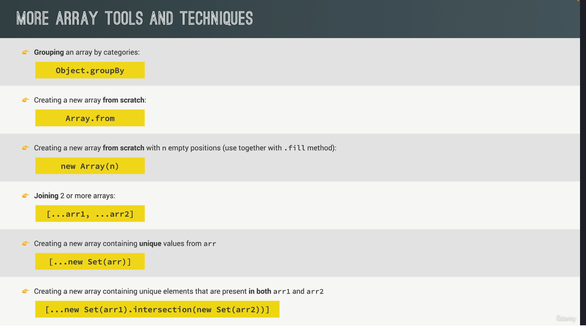

# Section - 09

repo - https://github.com/jonasschmedtmann/complete-javascript-course

**What we learn in this section**

1. Destructure Array (ok)
2. Destructure Object (ok)
3. The Spread operator (ok)
4. Rest pattern and parameters
5. Short Circuit (&& and ||)
6. Nullish(??)
7. for of
8. object literal
9. optional chaining(.?)
10. Loop Object : object key,values , entries
11. sets
12. assignments https://jonas.io/assignments/introduction.html#introduction

**FQA SECTION**

Q> Explain array destructuring in JavaScript.

Ans - A Array destructure will allow unpack value from array into distinct(alag/visist) variable using using a concise(short/sanchipt) syntax.

```
const [a, b] = [1, 2];
console.log(a, b); // Output: 1, 2
```

Q> How would you destructure an array and skip certain elements?

Ans - Use commas to skip elements.

```
const [a, , c] = [1, 2, 3];
console.log(a, c); // Output: 1, 3
```

Q> How would you swap the values of two variables using destructuring?

Ans - let a = 1, b = 2;

```
[a, b] = [b, a];
console.log(a, b);
```

Q> Destructure the following nested array to extract 3 and 6

```
const nestedArr = [[1, 2], [3, 4], [5, 6]];
const [, [a],[,b]] = nestedArr;
console.log(a,b);
```

**Object Destructure**

```
for (const element of restaurantList) {
  const {
    details,
    details: { cuisine, rating },
  } = element;
  console.log("details", details);
  console.log("cuisine : ", cuisine, "  || rating : ", rating);
}
```

Q> Given the object below, destructure to extract the name of the second employee and the city of the location.

```
const company = {
  name: "TechCorp",
  employees: [
    { name: "Alice", role: "Developer" },
    { name: "Bob", role: "Designer" },
  ],
  location: {
    city: "San Francisco",
    country: "USA",
  },
};

//name of the second employee  and the city of the location.
const {employees : [,{name}], location : {city}} = company
console.log('name : ', name,city);
```

Q> How would you extract data when you have both arrays and objects?

```
const data = [
  { id: 1, info: { name: "Alice", age: 30 } },
  { id: 2, info: { name: "Bob", age: 25 } },
];

for (const { id, info: { name, age} } of data) {
  console.log('element : ', `Hi your id is ${id} and your name is ${name} and your age is ${age}`);
}
```

**Spread Operator and Rest Operator**

The **spread operator** allows you to take an array or object and expand its elements/properties into a new array, object, or as arguments to a function.

Q> What is the output of the following?

```
const obj1 = { a: 1, b: { c: 2 } };
const obj2 = { ...obj1 };
obj2.b.c = 3;
console.log(obj1.b.c);
console.log(obj2.b.c);
```

Q> How does the spread operator behave with sparse arrays?

Undefined

```
const arr = [1, , 3];
const newArr = [...arr];
console.log(newArr); // ?
```

The **rest operator** collects multiple elements or properties into a single array or object. It is primarily used in function parameters or destructuring assignments to gather remaining values.

or

The **rest operator** allows you to gather multiple elements or properties into a new array or object

**Feature Spread Operator Rest Operator**

_Purpose_ Expands elements/properties **Gathers elements/properties**

_Use Case_ Function calls, array/object copying, **combining Function parameters, destructuring**

_Context_ Expands into individual items **Combines into an array/object**

Q> How do you handle deep destructuring with the rest operator?

```
const data = {
  user: {
    id: 1,
    name: "John Doe",
    details: {
      age: 30,
      city: "New York",
      country: "USA",
    },
  },
  status: "active",
  role: "admin",
};

const {
  user: {
    details: { city, ...country },
  },
  ...role
} = data;
console.log("user : ", city, country);
console.log("role : ", role);
```

Q> How can you use the rest operator to implement a flexible pipeline of functions?

```
const test = (number, ...AllFunction) => {
    return AllFunction.reduce((acc, fn) => acc * fn(number), 1);
}
const multiply = (x) => x * x;
const square = (x) => x ** x
const result = test(3, multiply, square);
console.log('result : ', result);
```

Q> What difference between or(||) and nullish operate(??)

The || operator returns the first truthy value or the last value if all are falsy.

It treats the following **values as falsy:** false, 0, '' (empty string), null, undefined, and NaN.

```
const value = 0 || 'default';
console.log(value); // Output: 'default' (0 is falsy)

const value2 = false || 42;
console.log(value2); // Output: 42 (false is falsy)
```

The **?? operator specifically returns the right-hand operand only if the left-hand operand is null or undefined.**

It does not consider other falsy values like 0, false, or ''.

```
const value = 0 ?? 'default';
console.log(value); // Output: 0 (0 is not null or undefined)

const value2 = null ?? 'default';
console.log(value2); // Output: 'default' (null is nullish)

const value3 = undefined ?? 42;
console.log(value3); // Output: 42 (undefined is nullish)
```

**When to Use**

|| is useful for general truthy/falsy checks:

```
const name = '' || 'Anonymous'; // Output: 'Anonymous'
```

?? is useful when 0, false, or '' are valid values:

```
const count = 0 ?? 10; // Output: 0
```

<!-- ==============================INTERVIEW QUESTION================================ -->

# Q> Marge id and increase numbers

```
const starterMenu = [
  {
    id: 1,
    name: "Garlic Bread",
    description: "Crispy bread topped with garlic butter and herbs",
    price: 5.99,
  },
  {
    id: 2,
    name: "Bruschetta",
    description: "Toasted bread with fresh tomatoes, basil, and olive oil",
    price: 6.99,
  },
  {
    id: 3,
    name: "Caesar Salad",
    description: "Classic Caesar salad with romaine, croutons, and Parmesan",
    price: 7.49,
  },
  {
    id: 4,
    name: "Spring Rolls",
    description:
      "Crispy rolls filled with vegetables and served with dipping sauce",
    price: 4.99,
  },
  {
    id: 5,
    name: "Stuffed Mushrooms",
    description: "Baked mushrooms filled with cheese and herbs",
    price: 6.49,
  },
];

const mainMenu = [
  {
    id: 1,
    name: "Grilled Chicken",
    description: "Marinated chicken breast grilled to perfection",
    price: 14.99,
  },
  {
    id: 2,
    name: "Spaghetti Carbonara",
    description: "Classic Italian pasta with creamy sauce and pancetta",
    price: 13.99,
  },
];

const dessertMenu = [...starterMenu, ...mainMenu];
const test = new Set(dessertMenu.map((menu) => menu.id));
console.log('test', test);

let newid = 1;
dessertMenu.forEach((menu) => {
    console.log('menuHas', test.has(menu.id));

  if (test.has(menu.id)) {
    menu.id = newid++;
    test.add(menu.id);
  }
});
console.log("dessertMenu", dessertMenu);

```

# Q> Find unique Email id

```
const users = [
  { id: 1, name: "Alice", email: "alice@example.com" },
  { id: 2, name: "Bob", email: "bob@example.com" },
  { id: 3, name: "Alice", email: "alice@example.com" },
  { id: 4, name: "Charlie", email: "charlie@example.com" },
];

const checkEmail = () => {
  return users.reduce((acc, user) => {
    acc[user.email] = (acc[user.email] || 0) + 1;
    return acc;
  }, {});
};
console.log("checkEmail : ", checkEmail());

const getDuplicates = (emailCounts) => {
  return Object.keys(emailCounts).filter((email) => emailCounts[email] > 1);
};

console.log("checkEmailFilter : ", getDuplicates(checkEmail()));
```

# Q> Find unique transition id

const transactions = [
{ transaction_id: "TX001", amount: 100 },
{ transaction_id: "TX002", amount: 200 },
{ transaction_id: "TX001", amount: 150 },
{ transaction_id: "TX003", amount: 250 },
];

```
const uniqueTransactionIds = () => {
  return transactions.reduce((uniqueIds, transaction) => {
    uniqueIds[transaction.transaction_id] =
      (uniqueIds[transaction.transaction_id] || 0) + 1;
    return uniqueIds;
  }, {});
};

const uniqueDupicate = (passedArray) => {
  const dupliCate = Object.keys(passedArray).filter(
    (key) => passedArray[key] > 1
  );
  const unique = Object.keys(passedArray).filter(
    (key) => passedArray[key] === 1
  );
  return {
    duplicate: dupliCate,
    unique: unique,
  };
};

console.log(uniqueDupicate(uniqueTransactionIds()));
```

# Q> How can you get index of array

```
const fruits = ["apple", "banana", "cherry"];
const vegs = ["potato", "tomato", "carrot"];

const all = [...fruits, ...vegs];

for (const[index, value] of all.entries()) {
  console.log('index : ',index,'value : ',value);
}

Note :  all.entries()
- Returns an iterable of key, value pairs for every entry in the array
```

# Q> Find when restore open and close.

```
const weekdays = ["mon", "tus", "wed", "thu", "fri", "sat", "sun"];
const [mon, tus, wed, thu, fri] = weekdays;

const restoreStatus = {
  mon: {
    open: "9:00am",
    close: "22:00pm",
  },
  tus: {
    open: "9:00am",
    close: "2:00pm",
  },
  wed: {
    open: "9:00am",
    close: "12:00pm",
  },
  thu: {
    open: "9:00am",
    close: "2:00pm",
  },
  fri: {
    open: "9:00am",
    close: "2:00pm",
  },
};

for (const day of weekdays) {
  const open = restoreStatus[day];
  open !== undefined
    ? console.log(`${day} open at ${open.open} and close at ${open.close}`)
    : console.log(`${day} Holiday`);
}
```

# Q> Object key and object Val

let objKey = Object.keys(restoreStatus);

let objValue = Object.values(restoreStatus);

return type will be [];

```
const weekdays = ["mon", "tus", "wed", "thu", "fri", "sat", "sun"];
const [mon, tus, wed, thu, fri] = weekdays;

const restoreStatus = {
  mon: {
    open: "9:00am",
    close: "22:00pm",
  },
  tus: {
    open: "9:00am",
    close: "2:00pm",
  },
  wed: {
    open: "9:00am",
    close: "12:00pm",
  },
  thu: {
    open: "9:00am",
    close: "2:00pm",
  },
  fri: {
    open: "9:00am",
    close: "2:00pm",
  },
};

let objKey = Object.keys(restoreStatus);
let objValue = Object.values(restoreStatus);
let openDays = `we are open ${objKey.length} days: `;
for (const days of Object.keys(restoreStatus)) {
  openDays += `${days.toLocaleUpperCase()}, `;
}
console.log("element : ", openDays);
console.log("objValue : ", objValue);
```

# > SET

- It's unique collection and never have any duplicate collection.

- return type will be (primitive (String, Boolean, Number.etc))

```
const setExm = new Set('pizzaapple');

console.log(setExm.size); // 6
console.log(setExm.has('p')); // true
console.log(setExm.has('o')); // false
console.log(setExm.add('o')); // { 'p', 'i', 'z', 'a', 'l', 'e', 'o' }
console.log(setExm.delete('o')); // { 'p', 'i', 'z', 'a', 'l', 'e' }
console.log(setExm.clear()); // {}


console.log(setExm);
```

# > Intersection

- Find the duplicate values of the Set.

```
const italianFood = new Set(['Pizza', 'Pasta', 'Risotto', 'Spaghetti', 'Fusilli']);
const maxicalianFood = new Set(['Pizza', 'Pasta', 'Risotto']);

const duplicated = italianFood.intersection(maxicalianFood);
const unical = italianFood.union(maxicalianFood);
const spread = [...italianFood, ...maxicalianFood];
const difference = italianFood.difference(maxicalianFood);
const symanticAll = italianFood.symmetricDifference(maxicalianFood);

console.log(duplicated); // Set { 'Pizza', 'Pasta', 'Risotto' }
console.log('unical : ',unical); // Set { 'Pizza', 'Pasta', 'Risotto', 'Spaghetti', 'Fusilli' }
console.log('spread : ',spread); // [ 'Pizza', 'Pasta', 'Risotto', 'Spaghetti', 'Fusilli' ]
console.log('difference : ',difference); // Set { 'Spaghetti', 'Fusilli' }
console.log('symanticAll : ',symanticAll); // Set { 'Spaghetti', 'Fusilli', 'Pizza', 'Pasta', 'Risotto' }
```

# > new Map()

- It allows you to store key-value pairs, where both the keys and values can be of any data type. Here's an overview of how to use Map effectively:

```
const allStore = new Map([
  ["Question", "Who is Pm of India?"],
  [1, "P.kumar"],
  ["key3", "value3"],
  [2, "Gandhi"],
  ["Correct", 2],
]);
console.log("allStore : ", allStore);

//Convert to Array
const arr = [...allStore];
console.log("arr : ", arr); //Array(4) [ [ 'Question', 'Who is Pm of India?' ], [ 1, 'P.kumar' ], [ 'key3', 'value3' ], [ 2, 'Gandhi' ] ]

//Convert to Object
const obj = Object.fromEntries(allStore);
console.log("obj : ", obj); //{ Question: 'Who is Pm of India?', 1: 'P.kumar', key3: 'value3', 2: 'Gandhi' }

//Map
//Iterable
for (const [key, value] of allStore) {
  typeof key === "number" && value === "Gandhi"
    ? console.log(`Answer ${key} : ${value}`)
    : console.log(`Wrong ${key} : ${value}`);
}

// const Answer =  prompt("Enter Your Answer");

// if (Number(Answer)=== allStore.get("Correct")) {
//   console.log("Your Answer is Correct");
// } else {
//   console.log("Your Answer is Wrong");
// }
```

# Q> Common Methods Between Arrays and Strings

1. length

- Returns the length of an array or string.

```
const arr = [1, 2, 3];
const str = "hello";
console.log(arr.length); // 3
console.log(str.length); // 5
```

2. indexOf()

- Returns the first index at which a specified element (or substring) is found, or -1 if not found.

```
const arr = [1, 2, 3, 2];
const str = "hello";
console.log(arr.indexOf(2)); // 1
console.log(str.indexOf('e')); // 1
```

3. includes()

- Returns type boolean.

```
const arr = [1, 2, 3];
const str = "hello";
console.log(arr.includes(2)); // true
console.log(str.includes('e')); // true

```

4. slice()

- slice(-,-), which is used to get the part of a string.
- First arguement represents your starting index, from there we can take n(difference of first and second arguement) charactor(s).
- In slice method, first arguement always less than second arguement.

```
const arr = [1, 2, 3, 4];
const str = "hello";
console.log(arr.slice(1, 3)); // [2, 3]
console.log(str.slice(1, 3)); // "el"
```

5. concat()

- concat(--), which is used to combine two strings..

```
const arr1 = [1, 2];
const arr2 = [3, 4];
const str1 = "hello";
const str2 = " world";
console.log(arr1.concat(arr2)); // [1, 2, 3, 4]
console.log(str1.concat(str2)); // "hello world"
```

# Q> padStart and padEnd Method

```
const masterCraditcard = (str) => {
  let string = str;
  let last4 = string.slice(-4);
  return last4.padStart(string.length, "*");
};

const result = masterCraditcard("1234567890123456");
console.log(result);
```

# Q> Closer

A closure in JavaScript is a function that "remembers" the variables from its outer scope even after the outer function has finished executing.

A closure is essentially a combination of a function and its lexical environment (the surrounding state where the function was defined).

```
const s1 = (p1) => {
    return (p2) => {
        console.log(`${p1} and ${p2}`);
    }
}

const data = s1("Hello");
data("World");
s1("Hello")("body");
```

# Q> Call and Apply and bind.

**Definition :** These three methods (call, apply, and bind) are used to control the value of this when invoking a function. They are especially useful when borrowing functions or reusing a function in a different context (object).

**The call()** method invokes a function and explicitly sets the value of this for that function. Additional arguments are passed individually.

```
func.call(thisArg, arg1, arg2, ...)
```

- **The apply()** method is similar to call(), but it takes arguments as an array instead of listing them individually.

```
func.apply(thisArg, [arg1, arg2, ...])

```

- **The bind()** method creates a new function with this explicitly set to the provided value. Unlike call and apply, it does not immediately invoke the function but returns a new function that can be invoked later.

```
const newFunc = func.bind(thisArg, arg1, arg2, ...)

```

**Use Case:**

- When you want to create a reusable function with a specific this context.

- Useful in event handlers or callbacks where this may lose its context.

  **STORY:** When we have two flight details and need to use the same function for another flight booking, we can use the call, apply, and bind methods in such situations.

```
const flight = {
    company: "Lufthansa",
    number: "LH123",
    gate: "23B",
    bookings: [],
    checkIn: function(flightNum, name){
       console.log(`${name} checked in to ${this.company} ${flightNum}`)
       flight.bookings.push({flight: `${this.company} ${flightNum}`, name: name,Gate: this.gate});
    }
}
flight.checkIn(23, 'mohamed');
flight.checkIn(24, 'ali');
flight.bookings.forEach((booking) => console.log(booking));

const secondFlight = {
    company: "Lufthansa",
    number: "Lh321",
    bookings: [],

}
//Assigning but this will not work
const book = flight.checkIn;
// book(89,'mohamed');  //Error typoError
book.call(secondFlight, 89,'john');
book.call(secondFlight, 9,'smith');
console.log(secondFlight.bookings);
```

```
//APPLY AND BIND EXAMPLE

let flightDetails = {
  company: "Cargo Jet",
  gate: 23,
  bookings: [],
  checkIn: function (flightNum, name) {
    console.log(`${name} checked in to ${this.company} ${flightNum}`);
    this.gate = this.gate === undefined ? 1 : this.gate + 1;
    this.bookings.push({
      flight: `${this.company} ${flightNum}`,
      name: name,
      Gate: this.gate,
    });
  },
};
const secondFlight = {
  company: "airline",
  bookings: [],
};
const book = flightDetails.checkIn;
const binAll = book.bind(secondFlight); //bind assign in a new function keyword
let flightData = [23, "mohamed"]; //rapping by array
book.apply(secondFlight, flightData);
binAll(24, "ali");

book.call(secondFlight, 9, "smith");
console.log(secondFlight); // { company: 'airline', bookings: [ { flight: 'airline 24', name: 'ali', Gate: 2 } ] }
```

# INTERVIEW QUESTION OF CALL,APPLY AND BIND

- What Should be out put.

```
01. function multiply(a, b) {
    console.log(a,b); //2,3
    return a * b;
}
const double = multiply.bind(null, 2);
const triple = double.bind(null, 3);
console.log(triple(2));

02. function Person(name) {
    this.name = name;
}
const obj = {};

Person.call(obj, 'mohamed');
console.log(obj.name);
console.log(obj);

03. function sayHello() {
    console.log(this.name);
}
const user = { name: "Alice" };
const boundHello = sayHello.bind(user);
boundHello.call({ name: "Bob" });

CASE : .bind(user) permanently sets this to user, making it impossible to override, even with .call() or .apply().

04. const car = {
    brand: "Toyota",
    getBrand: function() {
        return this.brand;
    }
};
const bike = { brand: "Honda" };
console.log(car.getBrand.call(bike)); // ?

**BONUS :**
Show out put of log(new Array(4).fill(0))
```

# q> What is IFFE

Reasoned about IIFE use case in JS for a few seconds
An IIFE (Immediately Invoked Function Expression) is a function in JavaScript that runs as soon as
it’s defined. It’s typically used to create a private scope

**Why Use an IIFE?**

- Encapsulation: Variables and functions declared inside the IIFE aren’t accessible outside of it.
- Avoiding Global Scope Pollution: Especially important in older JavaScript versions where var is
  function-scoped.
- Initialization Code: It’s a handy pattern for executing setup code that doesn’t need to be reused.

```
(()=> console.log("test defined"))() // Reason of empty () is to invoke the function.

(function() {
  // This code runs immediately.
  var message = "Hello, World!";
  console.log(message); // "Hello, World!"
})();

// Trying to access 'message' here would result in an error.

```

# Q> Closer

A closure is a function that "remembers" the variables from its outer scope
even after the outer function has finished executing.

```
function outerFunction(outerVariable) {
    return function innerFunction(innerVariable) {
        console.log(`Outer: ${outerVariable}, Inner: ${innerVariable}`);
    };
}

const closureExample = outerFunction("Hello");
closureExample("World");  // Output: Outer: Hello, Inner: World
```

**USE CASE**

1. Data Encapsulation
   from being accessed or modified directly.

```
function createCounter() {
    let count = 0;  // Private variable
    return {
        increment: function() {
            count++;
            console.log(`Count: ${count}`);
        },
        decrement: function() {
            count--;
            console.log(`Count: ${count}`);
        },
        getCount: function() {
            return count;
        }
    };
}

const counter = createCounter();
counter.increment(); // Count: 1
counter.increment(); // Count: 2
console.log(counter.getCount()); // 2
counter.decrement(); // Count: 1
```

2. Memoization
   The cache object remembers previously computed results, improving performance.

```
const memoizedFibonacci = () => {
  let cache = {}; // Stores computed values
  return (fib = (n) => {
   if(n in cache) return cache[n];
   return n <= 1 ? n : cache[n] = fib(n -1) + fib(n - 2)
  });
};

const fibonacci = memoizedFibonacci();
console.log(fibonacci(10)); // 55
```

# Q> New Map Method.

In JavaScript, the Map object is a built-in data structure that allows you to store key-value pairs, where keys can be of any data type (including objects and functions).

**Basic Methods of Map**

> Method Description

**set(key, value)** - Adds or updates a key-value pair.

**get(key)** - Retrieves the value associated with the key.

**has(key)** - Returns true if the key exists, otherwise false.

**delete(key)** - Removes a key-value pair.

**clear()** - Removes all key-value pairs.

**size** - Returns the number of key-value pairs.

```
const map = new Map();
map.set('name', 'John');
map.set('age', 30);
map.set('city', 'New York');

let getVal = map.delete('age', 30); // instead of delete we can use map.has('age') and map.get('age')
console.log(map);
```

> Iteration Methods

Method Description

**keys()** Returns an iterator of all keys.

**values()** Returns an iterator of all values.

**entries()** Returns an iterator of all key-value pairs as [key, value] arrays.

**forEach(callbackFn)** Iterates through each key-value pair in insertion order.

> > ARRAY METHOD

1. slice method.

The slice() method in JavaScript is used to create a shallow copy of an array or **extract a portion of an array or string without modifying the original data.**

```
array.slice(startIndex, endIndex);

```

2. Splice

The splice() method in JavaScript is used to modify an array by adding, removing, or replacing elements. Unlike slice(), splice() modifies the original array  
``
Difference Between slice() and splice()

Method Modifies Original Array? Returns New Array? Used for

slice() ❌ No ✅ Yes Extracting elements

splice() ✅ Yes ✅ Yes (removed elements) Adding, removing, replace

# Q> Filter and Reduce method

**Filter :**

```
array.filter(callback(element, index, array), thisArg);
```

- callback: A function that runs for each element in the array.
- element: The current element.
- index (optional): The index of the current element.
- array (optional): The original array.
- thisArg (optional): Value to use as this inside the callback.

# Q. const numbers = [1, 2, 3, 2, 4, 5, 3, 6]; //remove the duplicate value

Hints - by Set method

Hints - by filter

# Q. You have an array of user names. Return only the names that contain the letter "a" (case insensitive).

const users = ["Alice", "Bob", "Amanda", "Charlie", "David"];

output : //["Alice", "Amanda", "Charlie", "David"]

# Question: Remove all falsy values (false, 0, null, undefined, "", NaN) from an array.

# Q. What does map() return if no values satisfy the transformation condition?

Ans - Undefine

```
const arr = [1, 2, 3];
const result = arr.map(num => (num > 5 ? num * 2 : undefined));

console.log(result); // [undefined, undefined, undefined]
```

# Q. What does filter() return if no elements pass the condition?

Ans - it returns an empty array ([]).

```
const arr = [1, 2, 3];
const result = arr.filter(num => num > 5);

console.log(result); // []
```

# coding

1. Find max age in array

```
const users = [
  { name: "Alice", age: 25 },
  { name: "Bob", age: 30 },
  { name: "Charlie", age: 35 },
];

const nameInArr = users.reduce((acc, ele) => ele.age > acc.age ? ele : acc, users[0]);
console.log("nameInArr : ", nameInArr);
```

# Find Method

- find(-,-), which is used to find an element in the array, based on condition.
- , the .find() method is used to search for an element in an array that satisfies a given condition. It returns the first matching element or undefined if no match is found.
- Which take 2 arguments, one callback function and thisArg. and in function take pass argument (value,index,arr);

```
array.find(callback(element, index, array), thisArg);
```

# include

- this method use in array and string both
- The .includes() method is used to check whether an array or string contains a specified value. It **returns true if the value is found and false otherwise**.

```
array.includes(value, startIndex);

string.includes(substring, startIndex);

Ex -
const allowedColors = ["red", "green", "blue"];
const userColor = "red";

if (allowedColors.includes(userColor)) {
    console.log("Valid color");
} else {
    console.log("Invalid color");
}

EX - 2 FIND MISSING ELEMENTS
const findMissingElements = (arr1, arr2) => {
    let missingElement = arr1.filter(ele => !arr2.includes(ele));
    console.log(missingElement);
};

findMissingElements([1, 2, 3, 4, 5], [2, 4]);
```

# Some

- The Array.prototype.some() method in JavaScript is used to check if at least one element in an array satisfies a given condition. It returns a boolean value: true if at least one element meets the condition, and false otherwise.

```
arr.some(callback(element, index, array), thisArg)
```

# BONUS POiNTS

> Event Listener Methods

```
document.querySelector("button").addEventListener("click", () => console.log("Clicked!"));
document.removeEventListener("click", handler);
```

> Set & Map Methods

```
let set = new Set([1, 2, 3]);
set.add(4);
set.has(3); // true
set.delete(2);
set.clear();

let map = new Map();
map.set("name", "John");
map.get("name"); // "John"
map.has("name"); // true
map.delete("name");
map.clear();
```

> LocalStorage Methods

```
localStorage.setItem("key", "value"); // Stores
localStorage.getItem("key"); // Retrieves
localStorage.removeItem("key"); // Removes
localStorage.clear(); // Clears all
```

> JSON Methods

```
let jsonStr = '{"name": "John", "age": 30}';
JSON.parse(jsonStr);  // Converts to object
JSON.stringify({ name: "John", age: 30 }); // Converts to string
```

> Promise Methods

```
let promise = new Promise((resolve, reject) => resolve("Success"));
promise.then(res => console.log(res)); // "Success"
promise.catch(err => console.log(err));
promise.finally(() => console.log("Done"));

Promise.all([p1, p2, p3]); // Resolves when all promises resolve
Promise.race([p1, p2, p3]); // Resolves when first promise resolves
Promise.any([p1, p2, p3]);  // Resolves with first fulfilled promise
Promise.allSettled([p1, p2, p3]); // Returns results of all promises
```

> Function Method

```
function greet(name) {
  console.log("Hello " + name);
}
greet.length;        // Number of parameters (1)
greet.name;          // "greet"
greet.call(null, "John"); // "Hello John"
greet.apply(null, ["John"]); // "Hello John"
let boundFunc = greet.bind(null, "John");
boundFunc();         // "Hello John"
```

> Date Methods

```
let date = new Date();
date.getFullYear();  // 2025
date.getMonth();     // 0-11
date.getDate();      // 1-31
date.getDay();       // 0-6 (Sunday-Saturday)
date.getHours();     // 0-23
date.getMinutes();   // 0-59
date.getSeconds();   // 0-59
date.toISOString();  // "2025-02-19T12:34:56.789Z"
date.toDateString(); // "Wed Feb 19 2025"
date.toTimeString(); // "12:34:56 GMT+0000 (UTC)"
```

> Number Methods

```
let num = 123.456;
num.toFixed(2);      // "123.46"
num.toPrecision(4);  // "123.5"
num.toString();      // "123.456"
Number.isInteger(10); // true
Number.isNaN(NaN);   // true
Number.parseInt("10.5"); // 10
Number.parseFloat("10.5"); // 10.5
Math.round(4.7);     // 5
Math.floor(4.7);     // 4
Math.ceil(4.2);      // 5
Math.abs(-10);       // 10
Math.min(1, 2, 3);   // 1
Math.max(1, 2, 3);   // 3
Math.random();       // Random number between 0 and 1
```

> Object Methods

```
let obj = { name: "John", age: 30 };
Object.keys(obj);   // ["name", "age"]
Object.values(obj); // ["John", 30]
Object.entries(obj); // [["name", "John"], ["age", 30]]
Object.assign({}, obj, { gender: "Male" }); // Merges objects
Object.freeze(obj); // Prevents modification
Object.seal(obj);   // Prevents adding/removing properties
Object.hasOwnProperty("name"); // true
Object.getOwnPropertyNames(obj); // ["name", "age"]
```

> Array Methods

```
let arr = [1, 2, 3, 4, 5];
arr.length;         // 5
arr.push(6);        // Adds 6 to end
arr.pop();          // Removes last element
arr.shift();        // Removes first element
arr.unshift(0);     // Adds 0 to beginning
arr.includes(3);    // true
arr.indexOf(3);     // 2
arr.lastIndexOf(3); // 2
arr.reverse();      // [5, 4, 3, 2, 1]
arr.sort();         // Sorts alphabetically
arr.slice(1, 3);    // [2, 3]
arr.splice(2, 1);   // Removes 1 element at index 2
arr.join("-");      // "1-2-3-4-5"
arr.concat([6, 7]); // Merges arrays
arr.map(x => x * 2);  // [2, 4, 6, 8, 10]
arr.filter(x => x > 2); // [3, 4, 5]
arr.find(x => x > 2);   // 3 (first match)
arr.findIndex(x => x > 2); // 2
arr.reduce((a, b) => a + b, 0); // Sum
arr.every(x => x > 0); // true
arr.some(x => x > 4);  // true
arr.forEach(x => console.log(x)); // Iterates
```

> String Methods

```
let str = "Hello, World!";
str.length;           // 13
str.toUpperCase();    // "HELLO, WORLD!"
str.toLowerCase();    // "hello, world!"
str.charAt(0);        // "H"
str.indexOf("o");     // 4
str.lastIndexOf("o"); // 8
str.includes("Hello"); // true
str.startsWith("He"); // true
str.endsWith("!");    // true
str.slice(0, 5);      // "Hello"
str.substring(0, 5);  // "Hello"
str.substr(0, 5);     // "Hello" (deprecated)
str.replace("Hello", "Hi"); // "Hi, World!"
str.split(", ");      // ["Hello", "World!"]
str.trim();           // Removes spaces at start & end
str.repeat(3);        // "Hello, World!Hello, World!Hello, World!"
```

# Q What difference b/w Object.entries() & Object.fromEntries().

> Object.entries()

- Converts an object into an array of key-value pairs ([key, value]).
- Used for iteration and transformation.

```
const obj = { a: 1, b: 2, c: 3 };
console.log(Object.entries(obj));
//Output : - [ ['a', 1], ['b', 2], ['c', 3] ]
```

> Object.fromEntries()

- Converts an array of key-value pairs back into an object.
- Useful for reconstructing objects after transformations.

```
const entries = [['a', 1], ['b', 2], ['c', 3]];
console.log(Object.fromEntries(entries));
output - { a: 1, b: 2, c: 3 }
```

> Coding Round

```
Q: const obj = { x: 10, y: 20, z: 30 }; //{ x: 20, y: 40, z: 60 }

const modifiedObj = Object.fromEntries(
  Object.entries(obj).map(([key, value]) => [key, value * 2])
);

console.log(modifiedObj);

Q// const obj = { a: 1, b: 2, c: 3 }; // remove a key-value pair from an object.

const updatedObj =  Object.fromEntries(
  Object.entries(obj).filter(([key]) => key != 'b')
);

<!-- or -->
const updatedObj = Object.keys(obj).reduce((acc, key) => {
  key !== "b" && (acc[key] = obj[key]);
  return acc;
}, {});
```

# Q// Differance b/w flatMap and new Set().

### Feature flatMap() new Set()

- Works on - Arrays Any iterable (usually arrays)
- Purpose - Maps and flattens one level Removes duplicates
- Returns - A new array A Set (or an array if spread)
- Flattening - Yes (one level) No
- Uniqueness - No Yes

# SORT METHODS

Sorting Type Example

- Default (String) - arr.sort()
- Ascending (Numbers) - arr.sort((a, b) => a - b)
- Descending (Numbers) - arr.sort((a, b) => b - a)
- Case-Insensitive - arr.sort((a, b) => a.localeCompare(b))
- Objects (By Property) - arr.sort((a, b) => a.prop - b.prop)
- Dates - arr.sort((a, b) => a - b)
- Reverse Order .reverse()

# Q// What is Object.groupBy()

- The Object.groupBy() method is a new feature introduced in ES2023
- Returns → An object where keys are group names and values are arrays of grouped elements.

```
Object.groupBy(array, callbackFn);
```

```
Ex -01
const users = [
  { name: "Alice", age: 30 },
  { name: "Bob", age: 25 },
  { name: "Charlie", age: 30 },
  { name: "David", age: 25 }
];

// Group users by age
const groupedByAge = Object.groupBy(users, user => user.age);
console.log(groupedByAge);
//Output
{
  "30": [ { "name": "Alice", "age": 30 }, { "name": "Charlie", "age": 30 } ],
  "25": [ { "name": "Bob", "age": 25 }, { "name": "David", "age": 25 } ]
}

// Ex - 02

let products = [
  { name: "Pen", price: 5 },
  { name: "Notebook", price: 15 },
  { name: "Laptop", price: 1000 },
  { name: "Phone", price: 500 },
  { name: "Pencil", price: 3 },
];
let test = Object.groupBy(products, (product) => {
  if (product.price < 16) return "cheap";
  if (product.price < 501) return "medium";
  return "expensive";
});
for (const key in test) {
  console.log(key);
  test[key].sort((a, b) => a.price - b.price);
}

console.log('test : ',test);

EX- 03
let fruits = ["apple", "banana", "apple", "cherry", "banana", "apple"];

let uniqueFruits = Object.groupBy(fruits, (grp) => grp);
//convert Array type and coun
let newPass = Object.entries(uniqueFruits).map(([cnt, list]) => {
  return {
    cnt,
    list: list.length,
  };
});
console.log(newPass);

```

# Fill method

- The .fill() method in JavaScript is used to fill all or a portion of an array with a static value. It modifies the original array and returns it.

```
arr.fill(value, start, end)
```

```
Ex - 01

//Generating a Range of Numbers

let arr = Array.from({ length: 5 }, (_, i) => i + 1);
console.log(arr);

//Resetting an Array to Default Value
let scores = [85, 90, 78, 92];
scores.fill(0); // Reset all scores
console.log(scores); // [0,0,0,0,0]

```

> Use Cases of fill()

- Resetting an array to default values.
- Initializing an array with a specific value.
- Creating placeholders for upcoming data.
- Filling empty arrays for performance testing.
- Generating arrays for mapping operations.
  Note - we can define array in two way

1. let test = [1,23];
2. let arr = new Array(5).fill("A");

# Array.from() 
- The Array.from() method creates a new array from an iterable or array-like object. It allows transformations using a mapping function.
- The return type of Array.from() is a new array.

```
Array.from(arrayLike, mapFn, thisArg)
```

```
//Get Random Value
- Use Case: Useful for generating test data.

let randomNum =  Array.from({length: 7}, () => Math.floor(Math.random() * 10));
console.log('randomNum : ', randomNum);

//How do you remove null or undefined values using Array.from()?
let arr = [1, null, 2, undefined, 3]; // [1,2,3]

method : 1
console.log(arr.filter(Boolean));

Method : 2

```
# Math.trunc().
- that removes the decimal portion of a number and returns only the integer part.
```
console.log(Math.trunc(4.9));   // 4
console.log(Math.trunc(-4.9));  // -4
console.log(Math.trunc(0.99));  // 0
console.log(Math.trunc(-0.99)); // -0 (same as 0)
```
# Important method of Array H.w



# date time calling by api

```
let option = {
  hour: "numeric",
  minute: "numeric",
  day: "numeric",
  month: "numeric",
  year: "numeric",
  weekday: "long",

}
const dateTime = new Intl.DateTimeFormat("en-US",option).format(new Date());

labelDate.textContent = dateTime;
```
# Q// What is DOM
- Allow us make it Js interact wit your browser.
- Dom tree generate HTML document which we can interact with.
- it have capability to write modified html documents which we can interact


# What is Event Delegation?
- Event delegation is a JavaScript pattern that allows you to handle events efficiently by assigning a single event listener to a parent element instead of adding listeners to multiple child elements. This takes advantage of event bubbling, where an event propagates from the target element up to its ancestors.
```
document.getElementById("parent").addEventListener("click", function (event) {
    if (event.target.classList.contains("child-button")) {
        console.log("Button clicked:", event.target.textContent);
    }
});


Ex -02
document.querySelector('.nav').addEventListener('click', (e) => {
  let test = e.target.classList.contains('nav__link');
  console.log('test : ', test);
  if(test) {
    e.preventDefault();
    const id = e.target.getAttribute("href");
    console.log('id : ', id);
    document.querySelector(id).scrollIntoView({ behavior: "smooth" });
  }
})
```
✅ Handles dynamic elements

✅ Reduces memory usage

✅ Simplifies code management

# What is DOM Traversing?
- traversing refers to navigating through the elements (nodes) of a web page to find, modify, or interact with them using JavaScript. This is useful when you need to move between parent, child, and sibling elements dynamically.

1. Moving Up (Parent Elements)
- ### parentElement → Gets the direct parent of an element.
- ### closest(selector) → Finds the nearest ancestor that matches the selector.
```
const child = document.querySelector(".child");
console.log(child.parentElement); // Logs the parent element
```
2. Moving Down (Child Elements)
- ### children → Gets all direct children of an element (returns an HTMLCollection).
- ### querySelector / querySelectorAll → Finds specific children.
- ### firstElementChild / lastElementChild → Access first or last child.

3. Moving Sideways (Sibling Elements)
previousElementSibling → Gets the previous sibling.
nextElementSibling → Gets the next sibling.

```
const item = document.querySelector(".active");
console.log(item.nextElementSibling);  // Next element
console.log(item.previousElementSibling); // Previous element
```

✅ Helps navigate and manipulate elements dynamically.

✅ Useful when modifying nested structures like menus, forms, or tables.

✅ Improves performance by selecting elements efficiently.